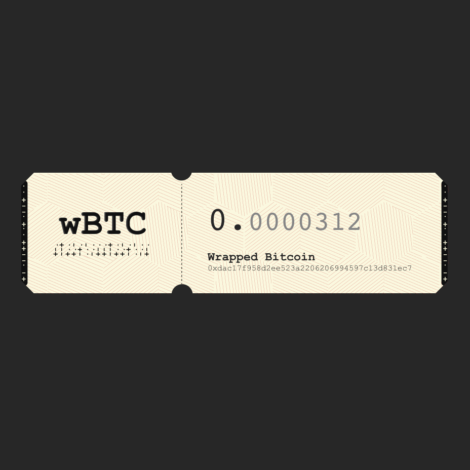

# Enclosed Money Contracts

Context: https://twitter.com/w1nt3r_eth/status/1556048520783638530



## Architecture

`v1` — the goal is to be very simple.

`NFTBill` is an ERC-1155 contract that holds the assets deposited by the users and hands them out corresponding NFTs.

- To deposit ERC-20s or Ether, the user calls `deposit`, the contract transfers the funds and gives the user back an NFT that represents ownership of that asset.
- To withdraw, the user calls `withdraw`, the NFT will be burned and the asset will be transferred back to the user.

`NFTBill` supports an arbitrary amount of assets in the same contract (i.e. it's a single NFT collection that has all different asset types in it). However, each NFT can only represent a single asset.

The implementation aims to be very gas-efficient. The ERC-20 contract address (or 0x00..00 for Ether) and the asset balance are [encoded in the ERC-1155 NFT token id](https://twitter.com/w1nt3r_eth/status/1538229135897554944):

```
Token ID: 0x95ad61b0a150d79219dcf64e1e6cc01f0b64c4ce 000000000000000000000001
            ^^^^^^^^^ ERC-20 token address ^^^^^^^^^ ^^^^^^^ Balance ^^^^^^^^
```

This means we only perform a single `SSTORE` when depositing or withdrawing the NFT.

Limitations:

- Balances larger than `type(uint96).max` are not supported
- Deflating or inflating assets are not supported

To make the protocol permissionless and decentralized, the metadata of the NFTs is stored on-chain (so it doesn't depend on any centralized services).

The metadata contract is upgradeable using OZ transparent upgradeable proxy. It allows us to hotfix rendering bugs, but the long-term plan is to renounce ownership. There's no admin functionality in the main contract.

The metadata should include (see screenshot above):

- Underlying asset address
- Underlying asset name and symbol (via ERC-20 `name` and `symbol`)
- Underlying asset value (formatted honoring ERC-20 `decimals`)
- "Fingerprint" visual symbols that make it easier to differentiate

TODO (maybe?):

- Implement on-chain SVG renderer
- Add a registry of popular coins and render them differently to further deter impostors (e.g. adding logos, using different colors, etc)
- Support approving and depositing data in a single tx (via `permit`)
- Support `permit`-like approvals for gasless withdrawals (might be useful for privacy work later)
- Support wrapping other NFTs
